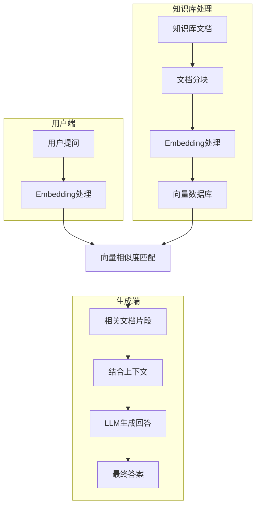

# 搭建本地知识库

---
title: 企业中AI的两种使用方式
level: 2
---

## 企业中AI的两种使用方式

一般企业会选择本地部署模型，而不是使用外部api。
我们需要针对特定的业务场景来调整AI，而不是把通用大模型直接部署使用。
（通用大模型知识存在局限性，它是通过网络公开的数据进行训练，因此没有一些实时性高的，非公开的比如公司业务数据的知识。
另外大模型存在幻觉问题，对于自己没有的信息，会一本正经的胡说八道。）

一个典型的需求，基于公司私有组件库生成代码。

有以下两种方式：

1. Fine-tuning（模型微调）， 把开源模型作为基座，使用企业特定的数据集进行训练，使得模型对于特定业务的表现更好。
2. RAG（Retrieval-Augmented Generation），检索增强生成技术。
  
<v-click>

### 模型微调的难点

最大的难点在于如何找到合适的数据集，数据集的质量对于模型训练的成果影响很大。

其次训练模型需要更高的硬件成本，需要更多计算资源。。。

</v-click>

---
title: RAG的原理
level: 2
layout: scroll
---

## RAG的原理

1. 准备外部知识库：外部知识库可能来自本地的文件、搜索引擎结果、API 等等。这样，RAG 不仅依赖于模型本身的内在的、通过训练得到的知识，还能实时调用外部的信息进行补充。
2. 通过 embedding 模型，对知识库文件进行解析：文本是由自然语言组成的，这种格式不利于机器直接计算相似度。embedding 模型要做的，就是将自然语言转化为高维向量，然后通过向量来捕捉到单词或句子背后的语义信息。；
3. 通过 embedding 模型，对用户的提问进行处理：用户的输入同样会经过嵌入（Embedding）处理，生成一个高维向量。
4. 拿用户的提问去匹配本地知识库：使用这个用户输入生成的这个高纬向量，去查询知识库中有无相关的文档片段。系统会利用某些相似度度量（如余弦相似度）去判断这个相似度。这一整个过程可以理解为，上传并解析了知识库之后，相当于给知识库中每一个小的文段都生成了一个指纹；然后用户输入问题之后，这个问题同样也会生成一个独一无二的指纹，接着RAGFLOW系统就会拿着用户输入的这个指纹，在指纹库也就是知识库中匹配，找到相似的指纹，然后把将检索到的这些相关文段与用户的输入结合，扩展模型的上下文，再喂给对话模型DeepSeek。

> 和模型微调的区别是，不用改变模型本身，相当于给模型外挂了一个可以查找的知识库

---
layout: scroll
---



---

## RAG最佳实践

- 文档预处理: 移除无关内容，保留核心信息
- 分块策略: 500-1000字符/块，重叠100字符  
- 元数据标注: 添加文档来源、更新时间等信息
- 测试查询: 准备20-30个典型问题验证效果
- 监控指标: 响应时间、召回率、准确率

---
title: 基于AnythingLLM RAG知识库的部署
level: 2
---

## 基于AnythingLLM RAG知识库的部署

目前开源知识库有很多，比如MaxKB，Dify，FastGPT,RagFLow,AnythingLLM等等。

其中AnythingLLM安装和部署比较简单，它是all-in-one的理念，而且强调零设置，不需要额外的配置。

另外AnythingLLM docker版本支持多用户模式，分为管理员，经理和默认3个角色。。。

- admin 完全访问整个系统
- Manager 可以查看所有工作区并管理除 LLM、嵌入器和矢量数据库的设置之外的所有属性
- Default 只能将聊天发送到明确添加到的工作区。看不到或编辑任何工作区或系统设置。  

还有它支持**API接口调用**，所以我认为已经能满足常见的使用场景了。

直接在官网安装 https://anythingllm.com/ 桌面版即可

我们本地采用ollama部署，所以第一步选择模型提供商时选择ollama

有工作区的概念，工作区里可以添加多个对话，工作区可以上传文件，上传文件并且更新完成后，聊天时就可以查询知识库了。
并且对话的时候会给出检索到知识的来源。。。

---
title: AnythingLLM服务端多人使用部署
level: 2
---
之前使用的是桌面客户端，适合单人使用。
也可以self-host，自己部署服务端，适合多人使用。  

官方提供了docker部署的方式

```shell
 docker pull mintplexlabs/anythingllm
```

如果是windows环境，执行下面的命令运行镜像

```powershell
$env:STORAGE_LOCATION="$HOME\Documents\anythingllm"; `
If(!(Test-Path $env:STORAGE_LOCATION)) {New-Item $env:STORAGE_LOCATION -ItemType Directory}; `
If(!(Test-Path "$env:STORAGE_LOCATION\.env")) {New-Item "$env:STORAGE_LOCATION\.env" -ItemType File}; `
docker run -d -p 3001:3001 `
--cap-add SYS_ADMIN `
-v "$env:STORAGE_LOCATION`:/app/server/storage" `
-v "$env:STORAGE_LOCATION\.env:/app/server/.env" `
-e STORAGE_DIR="/app/server/storage" `
mintplexlabs/anythingllm;
```

---

如果是linux/mac环境

```shell
export STORAGE_LOCATION=$HOME/anythingllm && \
mkdir -p $STORAGE_LOCATION && \
touch "$STORAGE_LOCATION/.env" && \
docker run -d -p 3001:3001 \
--cap-add SYS_ADMIN \
-v ${STORAGE_LOCATION}:/app/server/storage \
-v ${STORAGE_LOCATION}/.env:/app/server/.env \
-e STORAGE_DIR="/app/server/storage" \
mintplexlabs/anythingllm
```

管理员可以手动添加其他用户，或者通过api接口来批量新增用户。。。

---
title: RAGFlow部署
level: 2
hide: true
---

Ragflow是一种基于深厚文档理解的开源RAG引擎。

1. 确保vm.max_map_count=262144

这里我的环境是wsl2

```
wsl -d docker-desktop -u root
sysctl -w vm.max_map_count=262144
```

如果是linux系统，可以检查`vm.max_map_count`的值`sysctl vm.max_map_count`

如果不是，则执行命令手动设置

```
sudo sysctl -w vm.max_map_count=262144
```

可以在`/etc/sysctl.conf`中配置持久化`vm.max_map_count=262144`

---
title: dify开发平台
level: 2
---

## dify开发平台

Dify 是一款开源的大语言模型(LLM) 应用开发平台。它融合了后端即服务（Backend as Service）和 LLMOps 的理念，使开发者可以快速搭建生产级的生成式 AI 应用。即使你是非技术人员，也能参与到 AI 应用的定义和数据运营过程中。  
由于 Dify 内置了构建 LLM 应用所需的关键技术栈，包括对数百个模型的支持、直观的 Prompt 编排界面、高质量的 RAG 引擎、稳健的 Agent 框架、灵活的流程编排，并同时提供了一套易用的界面和 API。这为开发者节省了许多重复造轮子的时间，使其可以专注在创新和业务需求上。  
#### Dify 能做什么？

- 创业，快速的将你的 AI 应用创意变成现实，无论成功和失败都需要加速。在真实世界，已经有几十个团队通过 Dify 构建 MVP（最小可用产品）获得投资，或通过 POC（概念验证）赢得了客户的订单。

- 将 LLM 集成至已有业务，通过引入 LLM 增强现有应用的能力，接入 Dify 的 RESTful API 从而实现 Prompt 与业务代码的解耦，在 Dify 的管理界面是跟踪数据、成本和用量，持续改进应用效果。

- 作为企业级 LLM 基础设施，一些银行和大型互联网公司正在将 Dify 部署为企业内的 LLM 网关，加速 GenAI 技术在企业内的推广，并实现中心化的监管。

- 探索 LLM 的能力边界，即使你是一个技术爱好者，通过 Dify 也可以轻松的实践 Prompt 工程和 Agent 技术，在 GPTs 推出以前就已经有超过 60,000 开发者在 Dify 上创建了自己的第一个应用。

---
title: dify部署
level: 2
---

## dify部署
dify具有企业版和云服务，也提供了社区版。

有多种应用类型

- 对话
- ai智能体
- 生成（文本，图像，视频）
- 工作流

http://localhost:27080/apps

---
title: 平台对比
level: 2
---

| 方案        | 部署难度 | 多用户支持 | API支持 | 中文支持 | 工作流支持 | RAG能力 | 文档格式支持 | 适用场景         |
|------------|---------|-----------|---------|---------|-----------|---------|--------------|------------------|
| AnythingLLM | 简单    | ✅         | ✅       | ✅       | ❌         | 基础    | PDF/TXT/DOCX | 中小企业知识管理  |
| Dify       | 中等    | ✅         | ✅       | ✅       | Chatflow/Workflow 双模式      | 高级    | 多格式       | 企业级应用开发    |
| RAGFlow    | 复杂    | ✅         | ✅       | ✅       | 基于 Graph 的 Agentic RAG 工作流      | 专业    | 多格式      | 深度文档理解场景  |

> RAG flow，我试了一下最后没有部署，确实比较复杂。  
> 还有FastGPT,它的功能和dify类似，它是基于nextjs框架，dify前端基于nextjs，后端基于pyhon  
> dify社区版的功能强于FastGpt，dify 社区更活跃，github star是FastGpt的2倍
