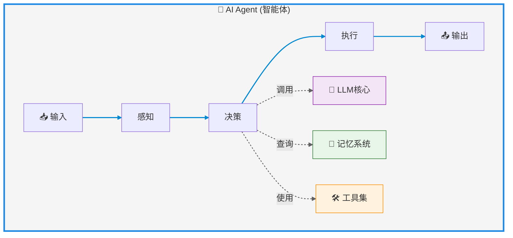

# AI Agent（智能体）

---

## AI Agent定义

AI Agent（人工智能代理，智能体）指的是能够在特定环境中自主感知、决策并执行任务的智能实体。它们结合了人工智能技术，具备环境互动、自主行动及目标导向的能力。

核心能力：环境交互、自主行动、目标导向

人类与AI协同的三种模式

1. Embedding模式（融合共生）：AI作为隐形的智慧助手，嵌入日常生活场景，优化细节（如搜索引擎推荐、电商个性化服务），人类仍主导大部分工作。
2. Copilot模式（共创辉煌）：AI成为人类的创意伙伴，例如GitHub Copilot辅助编程、设计工具激发灵感，需人类设定流程并调整结果。
3. Agent模式（自主领航）：AI具备高度自主性，独立执行任务（如自动驾驶、智能家居），人类仅需设定目标和监督结果

技术组成: llm大模型+记忆（Rag）+tools

---
layout: scroll
---

---

## AnythingLLM AI Agent使用

anythingLLM使用@agent,提供了网络爬取，网页浏览，保存文件之类的功能。

但是目前使用deepseek api 似乎不能调用工具。

https://docs.anythingllm.com/agent/usage

---

## vercel ai sdk 使用

---

## langchainjs 使用
