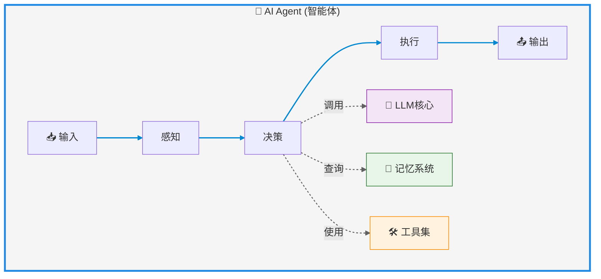
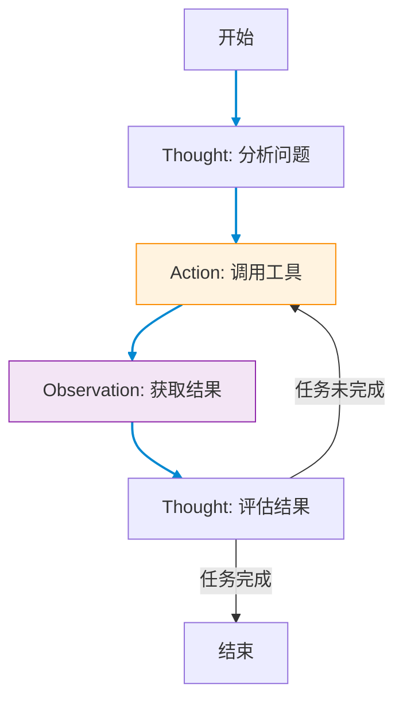

# AI Agent（智能体）

---

## AI Agent定义

AI Agent（人工智能代理，智能体）指的是能够在特定环境中自主感知、决策并执行任务的智能实体。它们结合了人工智能技术，具备环境互动、自主行动及目标导向的能力。

核心能力：环境交互、自主行动、目标导向

人类与AI协同的三种模式

1. Embedding模式（融合共生）：AI作为隐形的智慧助手，嵌入日常生活场景，优化细节（如搜索引擎推荐、电商个性化服务），人类仍主导大部分工作。
2. Copilot模式（共创辉煌）：AI成为人类的创意伙伴，例如GitHub Copilot辅助编程、设计工具激发灵感，需人类设定流程并调整结果。
3. Agent模式（自主领航）：AI具备高度自主性，独立执行任务（如自动驾驶、智能家居），人类仅需设定目标和监督结果

技术组成: llm大模型+记忆（Rag）+tools

---
layout: scroll
---



---

## AnythingLLM AI Agent使用

anythingLLM使用@agent,提供了网络爬取，网页浏览，保存文件之类的功能。

但是目前使用deepseek api 似乎不能调用工具。

https://docs.anythingllm.com/agent/usage

---
title: agent开发框架推荐
level: 2
---

## agent开发框架推荐

### vercel ai sdk

属于nextjs生态，相对于langchain，没有那么复杂，比较轻量级。并且提供了ui组件。

https://sdk.vercel.ai/docs/foundations/overview

### langchainjs

langchain是python社区的框架，也提供了typescript版本。
langchainjs抽象程度较高，理解成本更高。
社区生态更成熟，比如deepseek的官方文档里就提到了怎么接入langchain，阿里百炼也有相关的文档。
https://js.langchain.com/docs/introduction/

---

## vercel ai sdk 使用

https://sdk.vercel.ai/docs/foundations/overview

---

## langchainjs 使用

https://js.langchain.com/docs/introduction/

---

## ReAct 框架

ReAct (Reasoning + Acting) 是AI Agent的核心框架范式，由Yao等人于2022年提出，通过结合推理(Reasoning)和行动(Acting)实现复杂任务解决。

> 也就是最经典的实现agent的一种范式  

### 核心原理

1. **推理链(Chain-of-Thought)**：让LLM生成中间推理步骤
2. **行动执行(Action)**：调用外部工具/API获取信息
3. **观察反馈(Observation)**：基于执行结果调整策略

### 典型工作流程

```text
Thought: 我需要做什么？
Action: 调用[工具名称]
Observation: 工具返回结果
Thought: 基于结果，下一步应该...
```

(循环直至任务完成)

---

## 工作流程图示



---

```
Answer the following questions as best you can. You have access to the following tools:

tavily_search_results_json: A search engine optimized for comprehensive, accurate, and trusted results. Useful for when you need to answer questions about current events. Input should be a search query.
calculator: Useful for getting the result of a math expression. The input to this tool should be a valid mathematical expression that could be executed by a simple calculator.

Use the following format:

Question: the input question you must answer
Thought: you should always think about what to do
Action: the action to take, should be one of [tavily_search_results_json, calculator]
Action Input: the input to the action
Observation: the result of the action
... (this Thought/Action/Action Input/Observation can repeat N times)
Thought: I now know the final answer
Final Answer: the final answer to the original input question

Begin!

Question: 我有 17 美元，现在相当于多少人民币？
Thought:
```

langchain agent开发过程中，可以使用langsmith来调试 https://smith.langchain.com/
