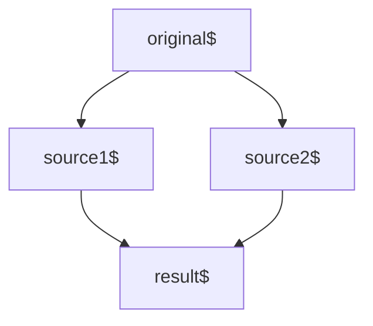

## 合并类操作符

| 功能需求                     | 适用的操作符                |
| ---------------------------- | --------------------------- |
| 把多个数据流已首尾相连的方式合并 | concat和concatAll         |
| 把多个数据流中数据以先到先得方式合并 | merge和mergeAll                           |
| 把多个数据流中数据以一一对应方式合并 | zip和zipAll             |
| 持续合并多个数据流中最新产生的数据 | combineLatest，combineAll和withLatestFrom |
| 从多个数据流中选取第一个产生内容的数据流 | race                    |
| 在数据流前面添加一个指定数据 | startWith                   |
| 只获取多个数据流最后产生的那个数据 | forkJoin |
| 从高阶数据流中切换数据源 | swicth和exhaust        |

---

### concat 首尾相连

```shell
 .\examples\014concat.ts
```

### merge 先到先得快速通过

```shell
 .\examples\015merge.ts
```

concurrent参数可以限流，只合并前concurrent个数据流

merge的应用场景
fromEvent绑定多个事件的情况，比如移动设备上touch事件比click事件先触发，
我们只用merge合并click事件和touch事件，接受最早到达那个，统一处理。

### zip 拉链式组合

zip的英文含义就是拉链，拉链的工作方式两端是一一对应的
这个方法就类似于python的zip

```shell
 .\examples\016zip.ts
```

数据积压问题

如果几个上游吐出数据的速度不一样，快速的数据流就会逐渐积压，造成内存占用。

---

### combineLatest 合并最新数据

```shell
 .\examples\017combineLatest.ts
```

**多重依赖问题**



会在同一时间出现两个数据，因为数据源是同一个，被认为是"同时产生",可以用withLatestFrom处理这个情况

```shell
 .\examples\018combineLatest2.ts
```

---

### withLatestFrom

类似于combineLatest,但是只能由一个observable pipe调用（实例操作符）
调用的那个observable的数据是主导地位，作为参数的Observable对象只能贡献数据，不能控制产生数据的时机。

也就是调用observable触发的时候才获取数据
这样也就解决了combineLatest多重依赖的问题，因为只有主导的observable对象触发的时候才会获取数据，所以不会出现触发两次的情况。

### race 赢者通吃
也就类似于promise.race

多个Observable对象，谁先产生数据，就由谁来决定结果。其余的会被退订。

### startWith

在数据流前面添加一个指定数据

startWith的功能也可以用concat实现

---

### forkJoin

合并所有参数的最后一个数据
