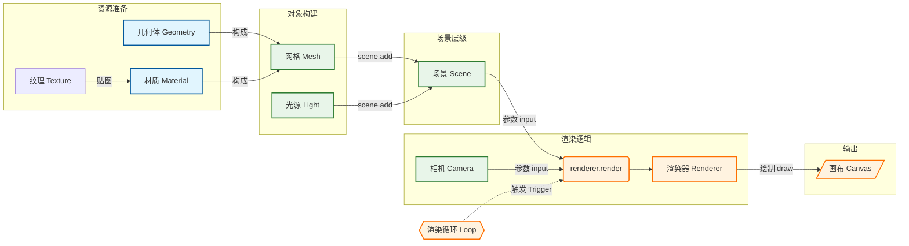

# 基础闭环

---
title: 基本元素介绍
level: 2
---

### 组成要素

- `Scene`：承载一切对象的容器，可配置背景与雾效
- `Geometry`：顶点、面与法线等几何数据，描述形状
- `Material`：外观与着色规则，决定如何被渲染
- `Mesh`：`Geometry + Material` 的可渲染实体
- `Camera`：观察参数（视野角、宽高比、近/远裁剪）
- `WebGLRenderer`：把场景按相机视角绘制到画布
- `Light`：为受光材质提供照明（基础材质不受光）

---
level: 2
---

### 关系与流程

- 几何体 + 材质 → 网格（Mesh）
- 将网格添加到场景（Scene）
- 通过相机（Camera）观察场景
- 渲染器（Renderer）依据相机把场景绘制到屏幕
- 使用渲染循环驱动每帧更新



---
layout: scroll
title: 最小闭环
level: 2
---

### 最小闭环

```ts

import * as THREE from 'three'
// 创建场景容器
const scene = new THREE.Scene()
// 加入物体（几何体 + 材质 → 网格）
{
  // 几何体：宽/高/深
  const geometry = new THREE.BoxGeometry(200, 200, 200)
  // 基础材质：纯色、不受光照影响
  const material = new THREE.MeshBasicMaterial({ color: 0x00ff00 })
  // 网格：几何体与材质组合后的可渲染对象
  const cube = new THREE.Mesh(geometry, material)
  // 添加到场景
  scene.add(cube)
}
// 透视相机：视野角、宽高比、近裁剪面、远裁剪面
const camera = new THREE.PerspectiveCamera(60, width / height, 0.1, 1000)
// 注意：默认相机位置在原点，若物体也在原点且尺寸较大，可能“看不到物体”；实际使用中应把相机移出物体外
// 渲染器：创建画布并启用抗锯齿
const renderer = new THREE.WebGLRenderer({ antialias: true })
// 设定画布尺寸（与页面一致）
renderer.setSize(width, height)
// 挂载到页面
document.body.appendChild(renderer.domElement)
// 渲染循环：每帧渲染并调度下一帧
function render() {
  renderer.render(scene, camera)
  requestAnimationFrame(render)
}
render()
```

下面是一个基础demo案例
---
layout: webgl
---

<Demo001start />

---
title: 自适应与像素比
level: 2
---

### 自适应与像素比
容器尺寸变化时，需要更新相机的宽高比（aspect）与渲染器的尺寸（setSize）。实现自适应。  
slidev中会用css进行画布缩放，所以不用加这行代码

```ts
function resize() {
  const { innerWidth, innerHeight } = window
  camera.aspect = innerWidth / innerHeight
  camera.updateProjectionMatrix()
  renderer.setSize(innerWidth, innerHeight)
  renderer.setPixelRatio(Math.min(window.devicePixelRatio, 2))
}
window.addEventListener('resize', resize)
```

---
level: 2
---

## 调试工具

### 1. 内置辅助对象（Helpers）

- `AxesHelper`：显示坐标轴，避免方向迷失。
- `GridHelper`：地面参照，判断位置与比例。
- `CameraHelper`：可视化相机视锥体，调试投影与阴影相机。

```ts
const axes = new THREE.AxesHelper(200)
const grid = new THREE.GridHelper(600, 20)
scene.add(axes)
scene.add(grid)
```

### 2. GUI 控制面板（lil-gui）

- 运行时调整变量（材质颜色、相机参数、灯光强度等）。
- 推荐使用 `lil-gui`；

```ts
import { GUI } from 'three/examples/jsm/libs/lil-gui.module.min'
const gui = new GUI()
gui.add(mesh.position, 'x').min(-100).max(100).step(10)
gui.addColor(material, 'color')
```

---
hideInToc: true
---

### 3. 浏览器扩展（DevTools）

- Three.js Developer Tools：在 DevTools 中查看 Scene Graph，直接检查 Mesh/Material。
- Spector.js：捕捉渲染帧，分析 Draw Calls、着色器与纹理，定位性能瓶颈。

### 4. 性能监控

- `Stats.js`：FPS/MS/内存，可直观观察性能波动。
- `renderer.info`：几何体/纹理数量与 `calls`（Draw Calls）统计。

```ts
import Stats from 'three/examples/jsm/libs/stats.module.js'
const stats = new Stats()
document.body.appendChild(stats.dom)
function animate() {
  stats.begin()
  renderer.render(scene, camera)
  stats.end()
  requestAnimationFrame(animate)
}
animate()
console.log(renderer.info)
```

---
hideInToc: true
---

### 5. Shader 调试

- 颜色输出法：将数据映射到片元颜色，直观排查数值是否正确。
- 线框模式：`ShaderMaterial` 设置 `wireframe: true`，观察顶点位移与几何结构。

```glsl
// 片元着色器中输出 UV 以调试
gl_FragColor = vec4(vUv, 0.0, 1.0);
```

### 6. React 生态（R3F）补充

- Leva（`useControls`）：更现代的 GUI 控制。
- `@react-three/drei`：`<Stats />`、`<OrbitControls />` 等辅助组件。
- `r3f-perf`：更丰富的性能面板与统计。

### 总结建议

- 起步：加入 `AxesHelper` 与 `OrbitControls`，确保可见与可交互。
- 材质/光照开发：用 `lil-gui` 实时调参提高迭代效率。
- “看不见”问题：用 DevTools 检查是否在 Scene、是否透明、是否缩放为 0。
- 卡顿优化：挂 `Stats.js`、查看 `renderer.info`，必要时用 Spector.js 深度分析。

---
hideInToc: true
layout: webgl
---

<Demo002GUI />

---
level: 2
---

## 透视相机和视锥体

CameraHelper 可以可视化相机的视锥体，帮助调试投影与阴影相机。

### 核心参数

- `fov`：视野角，越大透视感越强、越“广角”。
- `aspect`：宽高比，应与画布一致，否则画面会被拉伸。
- `near` / `far`：近/远裁剪面，只有落在两者之间的物体才会被渲染。

### 视锥体是什么

- 透视相机会形成一个“金字塔形”的可见空间，这个体积就是视锥体。
- 物体位于视锥体之外会“看不见”，位于 `near` 之前或 `far` 之后也会被裁剪。

```ts
import * as THREE from 'three'
const camera = new THREE.PerspectiveCamera(60, 16 / 9, 1, 1000)
const helperCamera = new THREE.PerspectiveCamera(40, 16 / 9, 50, 300)
const helper = new THREE.CameraHelper(helperCamera)
scene.add(helper)
helperCamera.updateProjectionMatrix()
helper.update()
```

---
hideInToc: true
---

### 常见问题与经验法则

- 画面被拉伸：`aspect` 与画布不一致，更新宽高比并调用 `updateProjectionMatrix()`。
- 物体莫名消失：检查是否被 `near`/`far` 裁剪或被相机背对。
- 深度闪烁（Z-Fighting）：`near` 与 `far` 跨度过大，尽量缩小范围以提升深度精度。

---
layout: webgl
---

  <Demo003PerspectiveCamera />
