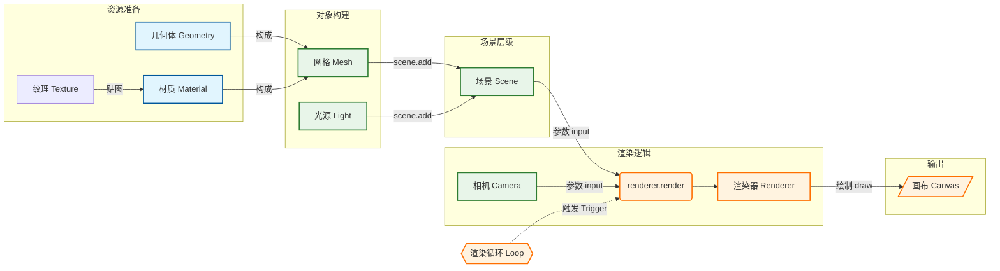

# 基础闭环

---
title: 基本元素介绍
level: 2
---

### 组成要素

- `Scene`：承载一切对象的容器，可配置背景与雾效
- `Geometry`：顶点、面与法线等几何数据，描述形状
- `Material`：外观与着色规则，决定如何被渲染
- `Mesh`：`Geometry + Material` 的可渲染实体
- `Camera`：观察参数（视野角、宽高比、近/远裁剪）
- `WebGLRenderer`：把场景按相机视角绘制到画布
- `Light`：为受光材质提供照明（基础材质不受光）

---

### 关系与流程

- 几何体 + 材质 → 网格（Mesh）
- 将网格添加到场景（Scene）
- 通过相机（Camera）观察场景
- 渲染器（Renderer）依据相机把场景绘制到屏幕
- 使用渲染循环驱动每帧更新



---
layout: scroll
title: 最小闭环
level: 2
---

### 最小闭环

```ts

import * as THREE from 'three'
// 创建场景容器
const scene = new THREE.Scene()
// 加入物体（几何体 + 材质 → 网格）
{
  // 几何体：宽/高/深
  const geometry = new THREE.BoxGeometry(200, 200, 200)
  // 基础材质：纯色、不受光照影响
  const material = new THREE.MeshBasicMaterial({ color: 0x00ff00 })
  // 网格：几何体与材质组合后的可渲染对象
  const cube = new THREE.Mesh(geometry, material)
  // 添加到场景
  scene.add(cube)
}
// 透视相机：视野角、宽高比、近裁剪面、远裁剪面
const camera = new THREE.PerspectiveCamera(60, width / height, 0.1, 1000)
// 注意：默认相机位置在原点，若物体也在原点且尺寸较大，可能“看不到物体”；实际使用中应把相机移出物体外
// 渲染器：创建画布并启用抗锯齿
const renderer = new THREE.WebGLRenderer({ antialias: true })
// 设定画布尺寸（与页面一致）
renderer.setSize(width, height)
// 挂载到页面
document.body.appendChild(renderer.domElement)
// 渲染循环：每帧渲染并调度下一帧
function render() {
  renderer.render(scene, camera)
  requestAnimationFrame(render)
}
render()
```

下面是一个基础demo案例
---
layout: none
---

<Demo001start />

---

### 自适应与像素比

```ts
function resize() {
  const { innerWidth, innerHeight } = window
  camera.aspect = innerWidth / innerHeight
  camera.updateProjectionMatrix()
  renderer.setSize(innerWidth, innerHeight)
  renderer.setPixelRatio(Math.min(window.devicePixelRatio, 2))
}
window.addEventListener('resize', resize)
```

### 坐标与默认约定

- 采用右手坐标系：X 向右、Y 向上、Z 指向屏幕外
- 相机默认朝向负 Z；常将相机置于正 Z 观察原点
- 若相机与物体重合或物体过大，可能不可见，应移动相机或物体
