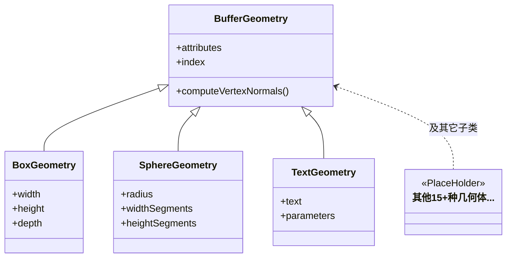

```mermaid
classDiagram
    direction TB
    %% 最顶层的基类
    class EventDispatcher {
        <<abstract>>
        +addEventListener()
        +removeEventListener()
        +dispatchEvent()
    }

    %% 三维对象的基类
    class Object3D {
        <<abstract>>
        +position: Vector3
        +rotation: Euler
        +scale: Vector3
        +add(object)
        +remove(object)
    }

    %% 所有几何体的基类
    class BufferGeometry {
        <<abstract>>
        +attributes: Object
        +index: BufferAttribute
        +boundingBox: Box3
        +setAttribute(name, attribute)
        +computeVertexNormals()
        +dispose()
    }

    %% 具体几何体实现
    class BoxGeometry {
        +width: Number
        +height: Number
        +depth: Number
    }

    class SphereGeometry {
        +radius: Number
        +widthSegments: Integer
        +heightSegments: Integer
    }

    class PlaneGeometry {
        +width: Number
        +height: Number
        +widthSegments: Integer
        +heightSegments: Integer
    }

    class CylinderGeometry {
        +radiusTop: Number
        +radiusBottom: Number
        +height: Number
        +radialSegments: Integer
    }

    class ConeGeometry {
        +radius: Number
        +height: Number
        +radialSegments: Integer
    }

    class TorusGeometry {
        +radius: Number
        +tube: Number
        +radialSegments: Integer
        +tubularSegments: Integer
    }

    class RingGeometry {
        +innerRadius: Number
        +outerRadius: Number
        +thetaSegments: Integer
        +phiSegments: Integer
    }

    class CircleGeometry {
        +radius: Number
        +segments: Integer
    }

    class TubeGeometry {
        +path: Curve
        +tubularSegments: Integer
        +radius: Number
        +radialSegments: Integer
    }

    class LatheGeometry {
        +points: Array
        +segments: Integer
        +phiStart: Number
        +phiLength: Number
    }

    class ExtrudeGeometry {
        +shapes: Shape
        +options: Object
    }

    class TextGeometry {
        +text: String
        +parameters: Object
    }

    class TorusKnotGeometry {
        +radius: Number
        +tube: Number
        +tubularSegments: Integer
        +radialSegments: Integer
        +p: Number
        +q: Number
    }

    class PolyhedronGeometry {
        +vertices: Array
        +indices: Array
        +radius: Number
        +detail: Integer
    }

    class DodecahedronGeometry {
        +radius: Number
        +detail: Integer
    }

    class IcosahedronGeometry {
        +radius: Number
        +detail: Integer
    }

    class OctahedronGeometry {
        +radius: Number
        +detail: Integer
    }

    class TetrahedronGeometry {
        +radius: Number
        +detail: Integer
    }

    %% 继承关系
    EventDispatcher <|-- Object3D
    Object3D <|-- BufferGeometry
    BufferGeometry <|-- BoxGeometry
    BufferGeometry <|-- SphereGeometry
    BufferGeometry <|-- PlaneGeometry
    BufferGeometry <|-- CylinderGeometry
    BufferGeometry <|-- ConeGeometry
    BufferGeometry <|-- TorusGeometry
    BufferGeometry <|-- RingGeometry
    BufferGeometry <|-- CircleGeometry
    BufferGeometry <|-- TubeGeometry
    BufferGeometry <|-- LatheGeometry
    BufferGeometry <|-- ExtrudeGeometry
    BufferGeometry <|-- TextGeometry
    BufferGeometry <|-- TorusKnotGeometry
    BufferGeometry <|-- PolyhedronGeometry
    BufferGeometry <|-- DodecahedronGeometry
    BufferGeometry <|-- IcosahedronGeometry
    BufferGeometry <|-- OctahedronGeometry
    BufferGeometry <|-- TetrahedronGeometry

    %% 分组注释
    note for BufferGeometry "所有现代 Three.js 几何体的基类"
    note for BoxGeometry "基础几何体"
    note for TextGeometry "复杂/特殊几何体"

```

## 几何体与材质

---
layout: scroll
level: 2
---

## BufferGeometry

https://threejs.org/docs/index.html?q=Geometry#BoxGeometry

BufferGeometry 是 Three.js 中现代几何体的共同基类。它用 TypedArray 存储顶点数据并直接面向 GPU，既省内存也更易于批量更新。

- attributes：顶点属性集合，如 `position`、`normal`、`uv`，每个属性由 `BufferAttribute` 表示
- index：可选的索引缓冲，用来复用顶点、减少面片重复；编辑几何体后记得同步更新
- computeVertexNormals()：当未提供法线或修改了 `position`/`index` 时，用此方法按面平均生成顶点法线

常见子类与用途：

- `BoxGeometry`：通过 `width`/`height`/`depth` 构建盒体，适合快速搭建场景元素
- `SphereGeometry`：用 `radius` 与经纬细分生成球体，常用于星球/球形指示器
- `TextGeometry`：基于字体曲线挤出生成文本网格，顶点数较多，适合静态标题

使用建议：

- 自定义形状或批量数据：直接使用 `BufferGeometry`，通过 `setAttribute('position', ...)` 构建顶点
- 修改几何后：设置 `geometry.attributes.position.needsUpdate = true` 并调用 `computeVertexNormals()`
- 性能优化：优先使用 `index` 合并重复顶点；大量实例考虑 `InstancedBufferGeometry`

---
layout: scroll
---

---
hide: true
---
<MermaidViewer>
<!-- markdownlint-disable MD046 -->

<!-- markdownlint-enable MD046 -->
</MermaidViewer>

---
level: 2
layout: none
---

<LazyRender>
  <Demo004BufferGeometry/>
</LazyRender>

---

上面的例子我们可以看出BufferGeometry是由多个三角形组成的  
可以基于多个三角形来构建复杂的几何体

### 目标

- 认识常用几何体与 BufferGeometry
- 对比 Basic/Phong/Standard 材质差异

### 要点

- 顶点/法线/UV 的作用
- PBR 与非 PBR 材质取舍

### 示例

---
layout: none
---

<LazyRender>
<GeometryShowcase />
</LazyRender>
